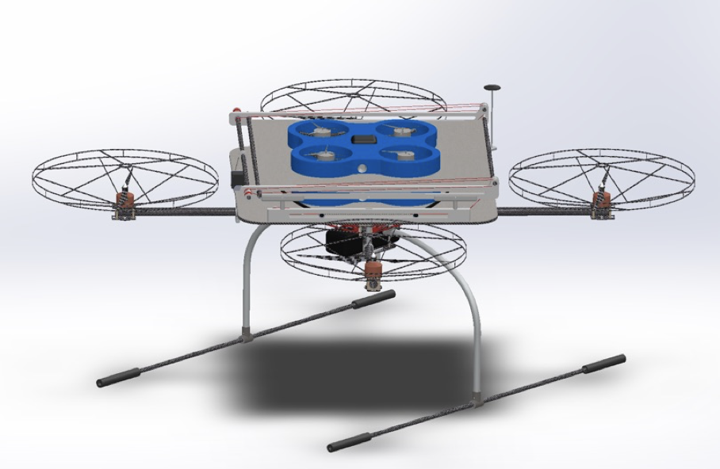

## Master Graduation Program

### 1.Introduction

 The title of my Master Program is Research on the Stability Control and  Autonomous Landing of Parent Platform of the Child-Parent UAV. 

When a major disaster occurs, it is critical to conduct a rapid and effective assessment of the disaster area environment. Traditional ground rescue methods have been difficult to meet the actual mission needs, and multi-rotor UAV systems provide a new solution to this type of problem, while the current commercial electric multi-rotor UAVs generally have an endurance time of no more than 30 minutes, and because of the limitations of battery technology, the endurance time of electric multi-rotor UAVs is difficult to be significantly improved. In our work, we design a Child-Parent UAV system based on this, which consists of a Parent UAV and two Child UAV. When going to the mission location, the Parent UAV is used as the main flight carrier, so that it does not need to consume the energy of the Child UAV. Upon arrival at the mission site, the Child UAV is then put into the mission and the Parent UAV can choose its own landing site for landing.

We focus on the interference problem caused by the docking and landing process of the Child UAV and the autonomous landing problem of the Parent UAV in the Child-Parent UAS as the main research object. Based on the PID control method, the control system of the Parent UAV is designed, and the aerodynamic interference and impact load model of the Parent UAV is established by combining the experimental and theoretical methods. The results show that the designed control system can ensure the stable flight of the parent UAV under the interference of the Child UAV. Under the condition of aerodynamic disturbance, the attitude angle of the Parent UAV does not change more than 5° and the horizontal displacement does not change more than 6 cm. Under the condition of shock load disturbance, the attitude angle of the Parent UAV does not change more than 15° and the altitude does not change more than 15 cm.

The design of the landing area search algorithm for the Parent UAV is completed. The algorithm is mainly divided into two stages, the first stage is a rough search, which can search the potential landing area and get a shortest search path according to the area location. The second stage is to score the potential landing area in turn according to the search path, find out the area with higher score for area calculation, and if the area of the area meets the landing requirement, the Parent UAV terminates the search for landing.

The main contents include:

- Design of Child-Parent UAV
- Parent UAV control system design
- Dynamic analysis of Parent UAV under the influence of Child UAV interference and impact load
- Landing area search without ground marker


### 2.Results

#### 2.1 Child-Parent UAV




#### 2.2 Dynamic Simulation

Height variation of the Parent UAV under aerodynamic disturbance conditions of the Child UAV:


Altitude variation of the Parent UAV under aerodynamic disturbance conditions of the Child UAV:


Height variation of the Parent UAV under impact load conditions of the Child UAV:


Altitude variation of the Parent UAV under impact load conditions of the Child UAV:


#### 2.3 Flying Experiment


#### 2.4 Landing Area Searching

Gazebo world: 


Parent UAV:


Rough searching of landing area:


Landing area score:


Landing area filtering:


Calculate IOU and generate relating position vector


### 3.Simulation Environment Configuration

Directory file structure:

- `piggy_WS`: Launch file of ROS, Parent UAV model, Gazebo world etc.
- `project_ws`: Landing area search algorithm, TF coordinate transformation, Offboard flight control code
- `ParentUAV_Modelsw.rar`: Parent UAV 3D Model in Solidworks
- `Matlab_Code`: Matlab and Simulink code


**step1:** Install ROS melodic

**step2:** Install px4

```
cd MasterGraduationProgram/piggy_WS/src/
git clone https://github.com/PX4/PX4-Autopilot.git --recursive Firmware
```

[Install reference](https://docs.px4.io/master/en/dev_setup/dev_env_linux_ubuntu.html#gazebo-jmavsim-and-nuttx-pixhawk-targets)

```
cd ~/
gedit .bashrc
```

Add the followings to the end of `.bashrc`

```
source {Path}/piggy_WS/devel/setup.bash
source {Path}/code/project_ws/devel/setup.bash
source {Path}/piggy_WS/src/Firmware/Tools/setup_gazebo.bash {Path}/piggy_WS/src/Firmware/ {Path}/piggy_WS/src/Firmware/build/px4_sitl_default
export ROS_PACKAGE_PATH=$ROS_PACKAGE_PATH:{Path}/piggy_WS/src/Firmware
export ROS_PACKAGE_PATH=$ROS_PACKAGE_PATH:{Path}/piggy_WS/src/Firmware/Tools/sitl_gazebo
export GAZEBO_MODEL_PATH=$GAZEBO_MODEL_PATH:{Path}/Piggy_WS/src/gazebo_world/models
```

**step3:** Launch ROS

```
roslaunch parent_drone parent_drone.launch
```

**step4:** Run Landing area search algorithm

```
rosrun disparity_handle disparity_handle
rosrun visual_landing visual_landing
```

### 
